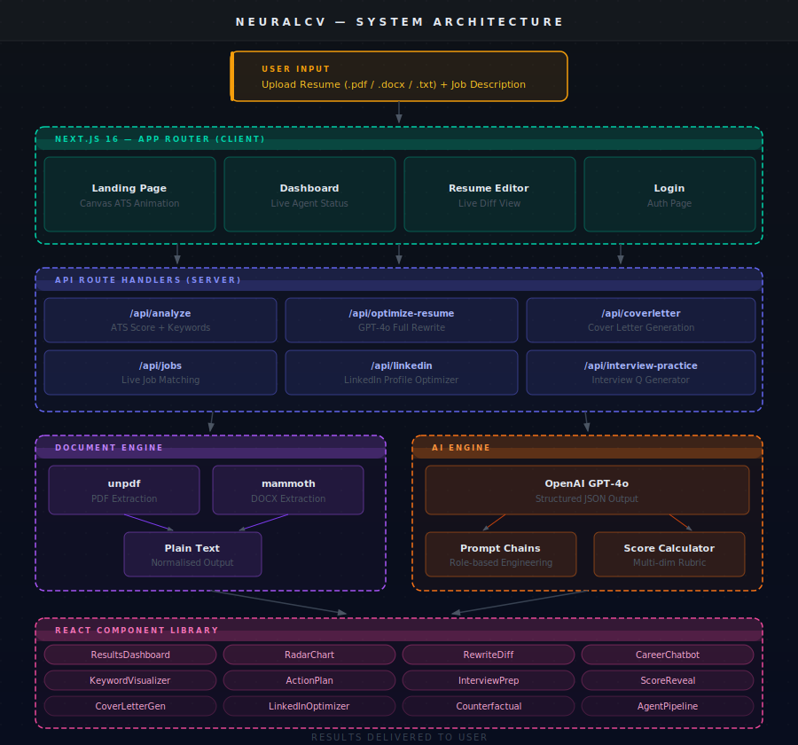

<div align="center">


<br/>

[](https://nextjs.org)
[](https://react.dev)
[](https://www.typescriptlang.org)
[](https://tailwindcss.com)
[](https://openai.com)
[](https://www.framer.com/motion)

<br/>

> ### **"Stop Getting Rejected. Start Getting Selected."**
>
> *NeuralCV is a full-stack AI platform that transforms resumes from ignored to irresistible.*
> *Live ATS scoring, GPT-4o rewrites, keyword gap analysis, interview prep, LinkedIn optimisation, and cover letter generation. All in under 15 seconds.*

<br/>

[](https://neuralcv-web.vercel.app)
[](#demo)
[](https://github.com/Preethi04S/NeuralCV/stargazers)

</div>

---

<div align="center">

## The Problem

```
  75% of resumes never reach a human recruiter.
  Not because the candidate is unqualified.
  Because the resume uses the wrong keywords,
  wrong format, or missing quantified impact.

  NeuralCV fixes all three in 15 seconds.
```

</div>

---

## System Architecture

<div align="center">

</div>

---

## Features

<table>
<tr>
<td width="50%" valign="top">

### ATS Score Engine
```
Upload Resume
      |
  Text Extraction (PDF / DOCX / TXT)
      |
  GPT-4o Structured Analysis
      |
 +-------------------------------+
 |  ATS Score          87 / 100 |
 |  Grade                    B+ |
 |  Keywords matched        34  |
 |  Critical gaps            6  |
 |  Format compliance      100% |
 |  Quantification score    78% |
 +-------------------------------+
      |
  RadarChart + ActionPlan
```

</td>
<td width="50%" valign="top">

### GPT-4o Rewrite Pipeline
```
BEFORE:
 "Worked on various projects"

         | NeuralCV AI Rewrite |

AFTER:
 "Engineered distributed microservices
  handling 2M+ req/day on AWS, reducing
  infrastructure costs by 34% through
  auto-scaling optimisation"

 Metrics injected      YES
 Strong action verb    YES
 ATS keywords added    YES
 Score impact:       +44 pts
```

</td>
</tr>
<tr>
<td width="50%" valign="top">

### Keyword Gap Heatmap
```
 Job Description        Your Resume

 React.js           YES  Present
 Node.js            YES  Present
 TypeScript         YES  Present
 AWS Lambda          NO  MISSING  <- add
 Docker             YES  Present
 Kubernetes          NO  MISSING  <- add
 CI/CD              YES  Present
 System Design       NO  MISSING  <- add

 Match rate: 62% -> 100% after fix
```

</td>
<td width="50%" valign="top">

### Interview Prep Generator
```
 Gap Detected: No system design experience

 Generated Questions:
  Q1. Walk me through designing a
      rate-limiting system at scale.
  Q2. How do you handle 10x traffic
      spikes in microservices?
  Q3. Explain your DB sharding approach
      for high-write scenarios.

  + Full model answer framework per Q
  + Tailored to your resume gaps
```

</td>
</tr>
</table>

---

## Full Feature List

| Feature | Description | AI Model |
|---------|-------------|----------|
| **ATS Score** | Real-time 0-100 compatibility score with grade and radar chart | GPT-4o |
| **Keyword Gap Analysis** | Visual heatmap of missing vs present JD keywords | GPT-4o |
| **Full Resume Rewrite** | Complete GPT-4o powered rewrite with before/after diff | GPT-4o |
| **Cover Letter Generator** | One-click tailored cover letter for any job description | GPT-4o |
| **LinkedIn Optimiser** | Section-by-section profile rewrite for target role | GPT-4o |
| **Interview Prep Pack** | Personalised questions and model answers based on your gaps | GPT-4o |
| **Career Chatbot** | Resume-aware AI chat for career advice and explanations | GPT-4o |
| **Counterfactual Simulator** | What if I had listed Kubernetes? Live score simulation | GPT-4o |
| **Job Matcher** | Live job recommendations based on your optimised profile | GPT-4o |
| **Action Plan** | Prioritised step-by-step improvement roadmap | GPT-4o |
| **Bias Scanner** | JD bias detection for gender-coded language and experience inflation | GPT-4o |
| **Integrity Check** | Detects formatting issues Workday and Greenhouse would reject | Rule-based |

---

## Tech Stack

| Layer | Technology | Why |
|-------|-----------|-----|
| **Framework** | Next.js 16.2 (App Router + Turbopack) | SSR, API routes, streaming |
| **UI Library** | React 19 + Tailwind CSS v4 | Latest concurrent features |
| **Animations** | Framer Motion 12 | Spring physics + scroll choreography |
| **Canvas** | HTML5 Canvas 2D (DPR-scaled) | 60fps ATS scan animation |
| **AI** | OpenAI GPT-4o (structured JSON outputs) | Best reasoning + speed |
| **PDF Parsing** | unpdf | Edge-compatible PDF text extraction |
| **DOCX Parsing** | mammoth | Faithful .docx to plain text |
| **Type System** | TypeScript 5 (strict) | Full safety across all layers |
| **Icons** | Lucide React | Consistent 24px icon set |
| **Hosting** | Vercel (Edge Network) | Zero-config Next.js deployment |

---

## Project Structure

```
neuralcv-web/
+-- app/
|   +-- page.tsx                    # Landing (hero + canvas ATS + comparison slider)
|   +-- dashboard/page.tsx          # Full analysis dashboard
|   +-- editor/page.tsx             # Resume editor + live diff
|   +-- login/page.tsx              # Auth (light-mode split layout)
|   +-- globals.css                 # CSS custom properties + theme tokens
|   +-- api/
|       +-- analyze/route.ts        # ATS score + keyword extraction
|       +-- optimize-resume/route.ts # GPT-4o full rewrite
|       +-- coverletter/route.ts    # Cover letter generation
|       +-- interview-practice/route.ts # Interview Q generation
|       +-- linkedin/route.ts       # LinkedIn profile optimiser
|       +-- jobs/route.ts           # Live job matching
+-- components/
|   +-- ResultsDashboard.tsx        # Master results orchestrator
|   +-- RadarChart.tsx              # SVG polar skill chart
|   +-- KeywordVisualizer.tsx       # Keyword gap heatmap
|   +-- RewriteDiff.tsx             # Before/after diff renderer
|   +-- CareerChatbot.tsx           # Resume-aware AI chat
|   +-- InterviewPrep.tsx           # Interview question pack
|   +-- CoverLetterGenerator.tsx    # Cover letter UI
|   +-- LinkedInOptimizer.tsx       # LinkedIn section rewriter
|   +-- CounterfactualSimulator.tsx # What-if score simulation
|   +-- ActionPlan.tsx              # Prioritised improvement steps
|   +-- ScoreReveal.tsx             # Animated score counter
|   +-- AgentPipeline.tsx           # Live AI agent status
+-- hooks/
|   +-- useTheme.ts                 # Dark / light mode toggle
+-- types/
    +-- analysis.ts                 # Full TypeScript type definitions
```

---

## Quickstart

```bash
# 1. Clone the repository
git clone https://github.com/Preethi04S/NeuralCV.git
cd NeuralCV

# 2. Install dependencies
npm install

# 3. Configure environment variables
cp .env.example .env.local
```

Edit `.env.local`:
```env
OPENAI_API_KEY=sk-your-key-here
```

```bash
# 4. Start development server
npm run dev
# Open http://localhost:3000

# 5. Build for production
npm run build
npm start
```

---

## Why NeuralCV Wins

> **The combination has never been built as one free, real-time web app.**

Most tools do one thing. Grammarly fixes grammar. Jobscan checks keywords. Resume.io gives templates. LinkedIn has basic suggestions.

**NeuralCV does all six in a single 15-second scan:**

1. ATS score with multi-dimension radar chart
2. Keyword gap heatmap matched to the actual JD
3. Full GPT-4o rewrite with live tracked diffs
4. Personalised interview prep based on your gaps
5. One-click tailored cover letter
6. LinkedIn profile rewrite for the target role

No account required. No paywall. No uploads to third parties.

---

<div align="center">

## Built at LovHack Season 2

**Preethi S** -- [github.com/Preethi04S](https://github.com/Preethi04S)

*"Built for the candidate who deserves the job but never got the call."*

<br/>

[](LICENSE)
[](https://github.com/Preethi04S/NeuralCV/pulls)
[](https://lovhack.devpost.com)

<br/>


</div>
